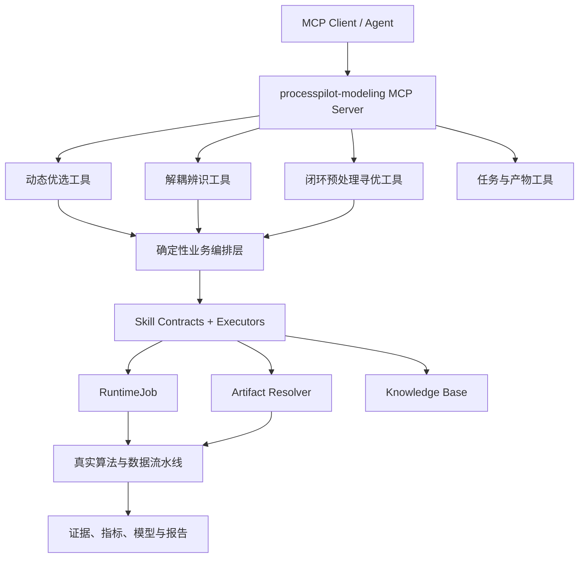

# ProcessPilot 工业建模 MCP 设计方案

> 文档状态：设计草案 v1.0  
> 适用项目：A14 ProcessPilot 生产加固版  
> 目标能力：动态优选、解耦辨识、闭环预处理寻优  
> 安全定位：离线建模与工程决策支持，不直接写入 PLC/DCS，不自动下发控制参数

## 1. 结论与架构决策

本项目适合增加 MCP，但 MCP 应作为现有工业算法、Skill、Executor 和任务系统之上的**标准适配层**，而不是重写算法或替代 Django API。

采用以下总体方案：

1. 建立一个 `processpilot-modeling` MCP Server，不为三个业务模块分别部署三个服务。
2. 对 Agent 暴露三个职责清晰的业务级计算工具：动态优选、解耦辨识、闭环预处理寻优。
3. 增加任务查询、任务取消和产物读取等基础工具，但不把 30 个内部 Skill 全部暴露给外部 Agent。
4. MCP Server 内部复用现有 Skill 契约、Executor、`RuntimeJob`、`RuntimeArtifactResolver`、知识库和运行证据。
5. Web 前端继续调用 Django REST API；MCP 是 Agent 集成接口，两者共享同一服务层，避免出现两套算法实现。
6. 长耗时计算继续以项目现有持久化任务队列为事实来源；客户端支持 MCP Tasks 时进行协议映射，不支持时返回 `job_id` 轮询。

这样可以减少 Agent 在大量细粒度 Skill 之间的误选，同时保留内部算法拆分、证据追踪和后续扩展能力。

## 2. 设计目标与非目标

### 2.1 设计目标

- 对齐 A14 赛题第（3）、（4）、（5）项能力，并能够从一次真实任务中提供完整证据。
- 让兼容 MCP 的 Agent 使用稳定、类型化、版本化的工具，而不是猜测内部 API 参数。
- 所有计算只引用已登记的数据资产，避免把整份工业 CSV 注入大模型上下文。
- 每次工具调用都能回答：谁调用、调用了什么、使用了哪些数据、执行了哪些 Skill、产生了哪些产物、通过了哪些质量门禁。
- 保证训练、验证、测试严格隔离，闭环寻优不能使用测试集调参。
- 支持长任务、重试、幂等、防重复提交、取消和进度查询。
- 对未知场景、证据不足、参数越界和生产控制请求进行明确拒绝。

### 2.2 非目标

- MCP 不负责提高底层算法本身的拟合度。
- MCP 不代替 Skill 路由评测、真实数据评测或知识库治理。
- MCP 不直接进行控制器投运、PLC/DCS 写入、联锁旁路或生产设定值修改。
- 第一阶段不把每个内部 Skill 都发布为外部 MCP Tool。
- 第一阶段不依赖向量数据库或本地大模型才能运行。

## 3. 为什么采用“一个 Server、三个业务工具”

现有项目已经有约 30 个业务 Skill、阶段级 Executor、产物依赖和质量门禁。如果将每个 Skill 都暴露为 MCP Tool，外部 Agent 必须自己理解复杂的调用顺序，容易产生以下问题：

- 跳过清洗或冻结分区，直接执行时滞与辨识；
- 重复运行共享阶段，造成结果不一致和资源浪费；
- 将“读取已有证据”误认为“重新执行算法”；
- 在寻优过程中错误使用测试集；
- 把离线寻优误述为生产闭环控制。

因此，外部接口只暴露稳定的业务意图，服务端内部通过确定性 DAG 调用必要的 Skill。内部仍保留细粒度 Skill，用于审计、测试和未来独立扩缩容。



## 4. MCP 能力清单

MCP Server 提供 Tools、Resources 和少量可选 Prompts。Tools 负责计算，Resources 负责只读证据，Prompts 只提供面向人的标准任务模板，不能承担安全控制。

### 4.1 三个核心计算工具

#### `run_dynamic_selection`

对应赛题第（3）项“高信噪比数据智能筛选”。

职责：

- 校验数据资产、场景、字段字典和冻结数据分区；
- 只在训练分区检测稳态/动态状态；
- 计算动态性、信噪比、持续激励、缺失率和异常率等评分分量；
- 截取并排序有效建模数据段；
- 生成可供后续建模使用的数据集和完整评分证据。

建议输入：

```json
{
  "dataset_id": "asset_xxx",
  "scene_id": "auto",
  "instruction": "提取适合铁水硅含量预测的高信噪比动态段",
  "target_variables": ["hot_metal_si"],
  "candidate_inputs": ["blast_temperature", "coal_rate"],
  "selection_policy": {
    "minimum_segment_samples": 60,
    "minimum_quality_score": 70,
    "maximum_missing_ratio": 0.05
  },
  "idempotency_key": "client-generated-key"
}
```

必要前置产物：`SOURCE_DATA`、`FIELD_DICTIONARY`、`CLEANED_TRAIN`、`FROZEN_SPLIT`。

主要输出产物：`SEGMENTATION_REPORT`、`SELECTED_SEGMENTS`、`SEGMENT_SCORES`、`SNR_ESTIMATES`、`MODELING_DATASET`。

必须通过的门禁：

- `training_partition_only`
- `minimum_valid_samples`
- `score_components_available`
- `source_and_split_hash_recorded`
- `no_synthetic_fallback`

如果严格合格段为 0，不得伪造成功结果。可以返回 `partial`，说明降级候选和风险，但不得自动把降级候选标为高质量数据。

#### `run_decoupling_identification`

对应赛题第（4）项，并包含第（5）项寻优前所需的基础 AR/ARX 辨识与验证。

职责：

- 对输入—输出组合执行非负、分段安全的时滞估计；
- 进行时间对齐和时滞补偿；
- 使用相关系数、VIF、条件数等证据识别共线性；
- 根据明确规则保留或剔除变量；
- 比较 AR 与 ARX 以及允许的阶次候选；
- 在同一冻结验证集上选择结构，随后生成残差、稳定性、多步预测和自由仿真证据；
- 不在该工具内进行多轮预处理闭环寻优。

建议输入：

```json
{
  "run_id": "20260915_xxx",
  "modeling_dataset_artifact_id": "artifact_xxx",
  "target_variables": ["hot_metal_si"],
  "candidate_inputs": ["blast_temperature", "coal_rate"],
  "delay_policy": {
    "method": "causal_cross_correlation",
    "maximum_lag_samples": 60,
    "allow_negative_lag": false
  },
  "collinearity_policy": {
    "maximum_vif": 10,
    "maximum_absolute_correlation": 0.95
  },
  "model_policy": {
    "families": ["AR", "ARX"],
    "output_orders": [1, 2, 3],
    "input_orders": [1, 2, 3]
  },
  "idempotency_key": "client-generated-key"
}
```

主要输出产物：`TIME_DELAY_ESTIMATES`、`DELAY_COMPENSATED_DATA`、变量保留/剔除证据、`MODEL_ARTIFACT`、`MODEL_METRICS`、`MODEL_DIAGNOSTICS`。

必须通过的门禁：

- `causal_delay`
- `maximum_lag_bound`
- `vif_or_correlation_evidence`
- `common_validation_targets`
- `uniform_split`
- `external_inputs_declared`
- `reproducible_fit`
- `residual_diagnostics`

互相关时滞只表示统计时间关系，不能自动宣称因果成立。时滞命中搜索上界、负时滞证据、严重共线性无法稳定消解时，必须返回警告或阻断。

#### `run_closed_loop_optimization`

对应赛题第（5）项“一键式闭环寻优引擎”。这里的“闭环”严格定义为：**离线数据预处理 → 建模 → 验证指标反馈 → 下一轮候选策略**，不是生产控制闭环。

职责：

- 以模型验证指标、误差、覆盖率和约束为目标函数；
- 循环搜索动态段数量、时滞范围、预处理参数和允许的模型结构；
- 所有候选使用同一个冻结验证目标；
- 选出优胜者并冻结后，只允许对测试集评估一次；
- 记录每轮候选、参数、数据哈希、样本数、指标、约束和停止原因；
- 输出最佳候选与工程准入判断，不能自动下发控制参数。

建议输入：

```json
{
  "run_id": "20260915_xxx",
  "baseline_model_artifact_id": "artifact_xxx",
  "objective": {
    "direction": "maximize",
    "formula_version": "fit-error-coverage-v1",
    "weights": {
      "validation_r2": 0.68,
      "error_score": 0.17,
      "training_coverage": 0.15
    }
  },
  "search_space": {
    "top_k_segments": {"type": "integer", "min": 2, "max": 20},
    "maximum_lag_samples": {"type": "integer", "min": 10, "max": 600}
  },
  "constraints": {
    "minimum_validation_r2": 0,
    "minimum_training_coverage": 0.05,
    "maximum_rounds": 16
  },
  "idempotency_key": "client-generated-key"
}
```

主要输出产物：`OPTIMIZATION_REPORT`、`OPTIMIZATION_WINNER`、优胜模型、独立测试证据和准入门禁报告。

必须通过的门禁：

- `real_data_only`
- `frozen_split_unchanged`
- `validation_hash_identical_across_candidates`
- `test_not_in_objective`
- `single_final_test`
- `bounded_search`
- `stopping_reason_recorded`

### 4.2 基础工具

| 工具 | 作用 | 属性 |
|---|---|---|
| `register_dataset` | 登记或上传数据并返回 `dataset_id`、哈希、大小和初步场景信息 | 写入型、幂等 |
| `get_job_status` | 获取状态、进度、当前阶段、部分结果和错误 | 只读、幂等 |
| `cancel_job` | 请求取消尚未完成的任务 | 写入型、幂等 |
| `list_run_artifacts` | 列出某次运行的类型化产物及校验值 | 只读、幂等 |
| `get_artifact_summary` | 获取产物元数据、摘要和安全预览 | 只读、幂等 |
| `compare_runs` | 只比较具有相同分区与目标定义的登记任务 | 只读、幂等 |

第一版不提供任意文件路径参数。所有数据和产物必须通过 `dataset_id`、`run_id` 或 `artifact_id` 引用，防止目录穿越和越权读取。

### 4.3 Resources

建议提供以下只读资源 URI：

```text
processpilot://server/capabilities
processpilot://scenes/{scene_id}/contract
processpilot://skills/catalog
processpilot://skills/{skill_id}/contract
processpilot://runs/{run_id}/manifest
processpilot://runs/{run_id}/evidence
processpilot://artifacts/{artifact_id}/metadata
processpilot://knowledge/search/{encoded_query}?scene_id={scene_id}
```

Resource 默认返回元数据和小型结构化摘要。大型 CSV、模型文件和图像仅返回受控下载引用，不直接塞进模型上下文。

### 4.4 Prompts

Prompt 不是核心依赖，只提供三种可选模板：

- `analyze_dynamic_segments`
- `identify_multivariable_process`
- `optimize_preprocessing_strategy`

Prompt 只帮助用户组织任务，不替代 Tool Schema、前置产物检查和安全门禁。

## 5. 统一返回信封

所有计算工具使用同一返回结构，避免每个工具自行定义状态语义。

```json
{
  "schema_version": "processpilot-mcp-result-v1",
  "request_id": "req_xxx",
  "job_id": "job_xxx",
  "run_id": "20260915_xxx",
  "status": "queued|running|completed|partial|blocked|failed|cancelled",
  "stage": "selection|modeling|optimization",
  "progress": {"completed": 3, "total": 8, "percent": 37.5},
  "invoked_skills": [
    {
      "skill_id": "high_snr_dynamic_segment_extractor",
      "contract_version": "1.0.0",
      "execution_state": "executed",
      "executor": "high_snr_dynamic_segment_extractor"
    }
  ],
  "input_artifacts": [],
  "output_artifacts": [],
  "metrics": {},
  "quality_gates": [],
  "warnings": [],
  "limitations": [],
  "provenance": {
    "dataset_hash": "sha256:...",
    "split_hash": "sha256:...",
    "code_version": "git-commit",
    "algorithm_versions": {},
    "started_at": "ISO-8601",
    "finished_at": "ISO-8601"
  }
}
```

`status=completed` 只表示本次计算正常完成，不代表模型具备生产投运资格。生产准入结论必须单独读取 `deployment_readiness`。

## 6. 调用顺序与服务端编排

### 6.1 标准顺序

```text
register_dataset
    ↓
run_dynamic_selection
    ↓ MODELING_DATASET
run_decoupling_identification
    ↓ MODEL_ARTIFACT + MODEL_METRICS + MODEL_DIAGNOSTICS
run_closed_loop_optimization
    ↓ OPTIMIZATION_WINNER + TEST EVIDENCE + REVIEW
```

服务端必须根据 Artifact Contract 检查前置条件。若用户直接调用后续工具：

- `auto_prepare=false`：返回 `blocked` 和缺失产物，不自动扩展任务范围；
- `auto_prepare=true`：仅执行明确允许的前置 DAG，并在结果中逐项记录，不能静默执行。

默认采用 `auto_prepare=false`，减少意外的长任务和资源消耗。

### 6.2 不允许 Agent 自由编排算法细节

Agent 可以选择三个业务工具和业务参数，但不能决定以下关键安全行为：

- 是否允许测试集参与搜索；
- 是否允许负时滞进入预测特征；
- 是否绕过字段和单位校验；
- 是否取消冻结分区；
- 是否跳过残差、稳定性与基线比较；
- 是否将离线结果直接标为可闭环投运。

这些规则固化在服务端执行策略中。

## 7. 长任务、幂等与取消

动态优选、辨识和寻优均可能超过普通工具调用的合理等待时间。实现规则如下：

1. 工具调用先完成参数校验、权限检查和幂等检查，再创建 `RuntimeJob`。
2. 默认快速返回 `accepted/queued`，携带 `job_id` 和 `run_id`。
3. Worker 执行真实算法，并持续写入阶段进度、事件和产物。
4. MCP 客户端通过 `get_job_status` 获取状态；支持 MCP Tasks 的客户端可映射到 Tasks 生命周期。
5. `idempotency_key + caller_id + tool_name` 建立唯一约束。相同请求不得重复创建昂贵任务。
6. 取消采用协作式取消：queued 任务立即取消，running 任务在安全检查点停止；已经生成的审计证据保留。
7. 重试只用于可恢复错误，算法参数错误、质量门禁失败和数据不合格不得盲目重试。

需要扩展当前 `RuntimeJob`：

- 增加 `cancel_requested_at`、`progress`、`current_stage`、`request_id`、`caller_id`、`tool_name`、`idempotency_key`；
- 区分 `blocked` 与 `failed`；
- 保存错误码，不只保存错误文本；
- 记录任务所用契约版本与代码版本。

## 8. Agent 路由与知识库

MCP 会减少接口歧义，但不会自动提升 Agent 的语义判断能力。路由精度依赖工具描述、输入约束、知识检索和真实评测。

### 8.1 路由规则

| 用户意图 | 应调用 | 不应调用 |
|---|---|---|
| “找出富含动态信息的数据段并评分” | `run_dynamic_selection` | 闭环寻优 |
| “估算时滞、处理共线性并训练 ARX” | `run_decoupling_identification` | 只做动态优选 |
| “循环调整预处理策略，找到验证拟合度最高方案” | `run_closed_loop_optimization` | 直接重复测试集评估 |
| “解释已有第 5 轮为何最好” | 读取运行证据或 `compare_runs` | 重新训练模型 |
| “把参数直接写入 DCS” | 拒绝并给出工程审批流程 | 任意计算工具代替控制下发 |

### 8.2 工具描述要求

每个工具描述必须包含：

- 适用意图；
- 不适用意图；
- 必要前置产物；
- 对数据和时间的典型消耗；
- 结果含义及不能推导的结论；
- 至少 5 个正例和 5 个易混淆反例。

### 8.3 知识库使用方式

沿用现有 `KnowledgeDocument`、`KnowledgeChunk`、`SkillKnowledgeRule` 和人工审核机制。知识库用于：

- 场景与变量别名解析；
- Skill 候选召回；
- 参数边界和算法适用条件说明；
- 历史成功/失败案例检索；
- 结果解释与限制声明。

知识库不能覆盖服务端硬门禁，也不能未经审核自动修改生产工具描述。向量检索仍按现有标准：积累至少 200 条真实人工标注问句并通过固定测试集后再启用。

## 9. 数据、安全与权限

### 9.1 数据边界

- MCP 返回数据摘要和产物引用，不默认返回完整原始数据。
- 数据资产登记时计算 SHA-256，后续运行绑定哈希。
- 禁止使用任意绝对路径、`..` 路径和外部 URL 作为算法输入。
- 下载大型产物需要单独权限与短期有效引用。
- 日志不得记录原始数据行、访问令牌、数据库口令或完整模型密钥。

### 9.2 权限建议

至少定义以下权限：

```text
datasets:register
datasets:read
modeling:run
optimization:run
runs:read
runs:cancel
artifacts:read
admin:audit
```

### 9.3 传输方式

- 本地单机演示优先使用 STDIO，凭证通过进程环境注入。
- Web/多用户部署使用 MCP 支持的 HTTP 传输并实施身份认证、授权、限流和审计。
- 不允许把本地 STDIO Server 直接暴露到公网。
- MCP 与现有 Django 服务共享业务代码，但远程入口应拥有独立的认证和速率限制策略。

### 9.4 工业安全红线

所有工具固定返回：

```json
{
  "control_mode": "advisory_only",
  "actuation_allowed": false
}
```

任何涉及控制器投运、控制参数写入、执行器动作或联锁修改的请求都返回 `CONTROL_ACTION_NOT_ALLOWED`。离线模型通过后，仍需工艺、自控、安全和运行责任人完成影子运行、仿真、限幅闭环、回退与人工审批。

## 10. 错误模型

错误必须同时包含稳定错误码、可读说明、是否可重试和修复建议。

| 错误码 | 含义 | 可重试 |
|---|---|---|
| `INVALID_ARGUMENT` | 参数类型、范围或组合不合法 | 否 |
| `DATASET_NOT_FOUND` | 数据资产不存在或无权访问 | 否 |
| `SCENE_UNRESOLVED` | 场景不能可靠识别 | 人工确认后 |
| `ARTIFACT_PRECONDITION_MISSING` | 缺少上游产物 | 完成前置步骤后 |
| `QUALITY_GATE_BLOCKED` | 数据或模型未通过硬门禁 | 修改数据/方案后 |
| `IDEMPOTENCY_CONFLICT` | 相同幂等键对应不同请求 | 否 |
| `JOB_CAPACITY_EXCEEDED` | 当前队列容量不足 | 是 |
| `EXECUTION_FAILED` | 算法或基础设施异常 | 视错误而定 |
| `CANCELLED` | 用户或系统取消任务 | 否 |
| `CONTROL_ACTION_NOT_ALLOWED` | 请求超出离线建议边界 | 否 |

不要把质量不合格归类为系统异常。`blocked` 表示系统正确阻止了不可靠结论，属于可验收行为。

## 11. 可观测性与审计

每次工具调用至少记录：

- `request_id`、`job_id`、`run_id`、调用方和工具名；
- MCP 协议能力、工具 Schema 版本、Skill Contract 版本；
- 输入参数摘要与参数哈希；
- 数据、分区和验证目标哈希；
- 实际执行的 Skill、Executor、状态、耗时和资源使用；
- 产物 ID、类型、生产者、版本和内容哈希；
- 每项质量门禁的判定和证据；
- 警告、限制、重试、取消和最终状态。

关键指标：

- 工具路由准确率、误触发率和未知请求拒绝率；
- 任务排队时间、执行时长、失败率、重试率、取消率；
- 重复请求被幂等拦截的数量；
- 各质量门禁阻断率；
- 不同场景的有效段比例、模型基线胜率与寻优改善量；
- 测试集重复访问违规次数，目标必须为 0；
- 未授权数据访问和控制动作尝试次数。

## 12. 测试与验收方案

### 12.1 协议与契约测试

- Tools 列表、名称、描述、输入和输出 Schema 快照测试；
- 必填字段、枚举、上下界、未知字段处理测试；
- Resource URI 解析、权限和大型内容截断测试；
- 统一返回信封和错误码测试；
- STDIO 与 HTTP 传输一致性测试。

### 12.2 算法复用一致性测试

同一个真实数据集、同一参数和同一代码版本下：

- Django API 与 MCP 产生相同数据哈希、分区哈希和关键指标；
- MCP 不得复制另一套动态筛选、时滞、VIF 或 ARX 算法；
- 相同幂等键只产生一个任务；
- 任务重试后产物可追溯且不会混用不同版本。

### 12.3 防泄漏测试

- 动态段筛选只读取训练分区；
- 时滞、共线性和参数估计只学习训练分区；
- 候选搜索只读取冻结验证集；
- 测试集只在优胜方案冻结后评估一次；
- 所有候选的验证目标哈希完全相同；
- 修改测试集不得改变最佳候选选择。

### 12.4 Agent 工具调用评测

建立冻结的 MCP 路由评测集，至少包含：

- 每个核心工具 50 条正例；
- 每对工具至少 30 条易混淆样例；
- 50 条只读问答，不应触发计算；
- 50 条未知或越权请求；
- 多场景、简称、错别字、否定、上下文省略和组合请求。

第一阶段发布门槛：

- 精确工具集准确率 ≥ 95%；
- 工具选择 micro precision/recall ≥ 95%；
- 未知请求拒绝率 ≥ 95%；
- 只读问题误触发昂贵计算率 ≤ 1%；
- 生产控制请求拒绝率 = 100%；
- 参数 Schema 合法率 = 100%；
- 测试集泄漏违规数 = 0。

真实生产准确率只能使用工程师审核的真实问句评估，不能用合成数据指标代替。

### 12.5 三个场景端到端验收

对高炉、脱丁烷塔、工业干燥器分别执行完整流程，并核验：

- 场景和字段语义正确；
- 动态段及质量评分可解释；
- 时滞单位和采样周期解释一致；
- 共线性保留/剔除依据完整；
- AR 与 ARX 公平比较；
- 寻优至少完成规定的探索轮次或给出合规早停原因；
- 每轮验证目标哈希一致；
- 最终测试只执行一次；
- 离线结论与生产准入结论严格分离。

## 13. 推荐代码结构

```text
core/mcp/
├── __init__.py
├── server.py                 # Server 初始化、能力注册
├── config.py                 # 传输、认证、限制与功能开关
├── context.py                # 调用方、权限、request_id
├── schemas/
│   ├── common.py
│   ├── dynamic_selection.py
│   ├── identification.py
│   └── optimization.py
├── tools/
│   ├── datasets.py
│   ├── dynamic_selection.py
│   ├── identification.py
│   ├── optimization.py
│   └── jobs.py
├── resources/
│   ├── skills.py
│   ├── scenes.py
│   ├── runs.py
│   └── knowledge.py
├── services/
│   ├── dispatcher.py         # MCP 请求到现有服务/Executor 的适配
│   ├── idempotency.py
│   ├── authorization.py
│   └── result_envelope.py
└── tests/
    ├── test_tool_contracts.py
    ├── test_resources.py
    ├── test_jobs.py
    ├── test_security.py
    ├── test_no_leakage.py
    └── test_e2e_real_scenes.py
```

关键约束：`core/mcp/` 只能做协议转换、授权、校验和调度；动态筛选、时滞、共线性、ARX 与寻优算法仍由现有服务和 Executor 实现。

## 14. 分阶段实施计划

### 阶段 0：冻结契约与基线

- 冻结三个核心工具的输入输出 Schema；
- 保存现有 Django API 在三个真实场景上的基线结果；
- 增加数据哈希、分区哈希、验证目标哈希和算法版本；
- 明确 `blocked/partial/failed` 的语义。

验收：同一任务可以完整复现，所有现有测试通过。

### 阶段 1：本地 STDIO MVP

- 创建一个 MCP Server；
- 实现三个核心工具和任务/产物辅助工具；
- 复用现有 `RuntimeJob` 和 Artifact Resolver；
- 增加幂等、前置产物检查、统一错误码和统一返回信封；
- 完成协议与算法一致性测试。

验收：本地 Agent 可以对真实登记数据完整调用三个模块，结果与现有 API 一致。

### 阶段 2：Resources、知识库与路由评测

- 发布场景、Skill、运行证据和知识库 Resources；
- 建立冻结的 MCP 工具调用评测集；
- 加入只读问题、未知意图和越权请求；
- 对误调用进行定向规则修正，不盲目重复训练。

验收：达到第 12.4 节质量门槛。

### 阶段 3：远程 HTTP 与生产加固

- 增加认证、细粒度权限、限流、租户隔离和审计；
- 支持大型产物的授权下载；
- 加入 Worker 容量、超时、取消和恢复机制；
- 与支持 MCP Tasks 的客户端做能力协商，同时保留 `job_id` 兼容接口。

验收：安全测试、并发测试、故障恢复和权限隔离全部通过。

### 阶段 4：真实反馈迭代

- 收集工程师确认的工具选择、参数纠正和失败案例；
- 按场景分层维护训练集与不可触碰测试集；
- 只有固定测试集指标显著提升时才更新路由模型或检索方案；
- 所有发布版本保留模型、语料、Schema 与评测报告哈希。

## 15. 关键风险与控制措施

| 风险 | 控制措施 |
|---|---|
| MCP 工具过细导致 Agent 乱序调用 | 只公开三个业务工具，内部采用确定性 DAG |
| MCP 工具过粗导致不可解释 | 返回实际 Skill、Executor、产物和门禁证据 |
| 长任务超时 | `RuntimeJob` 持久化，MCP Tasks/`job_id` 双兼容 |
| 重复调用浪费计算 | 幂等键、参数哈希和唯一约束 |
| 数据泄漏 | 数据资产引用、权限、摘要返回、路径隔离 |
| 测试集参与寻优 | 冻结分区、验证哈希一致、最终单次测试硬门禁 |
| 相关性被误述为因果 | 结果固定写入统计限制和工程复核要求 |
| 离线闭环被误认为生产闭环 | `advisory_only`、禁止控制写入、独立准入报告 |
| MCP 和 REST 结果分叉 | 两种接口共用同一服务与 Executor，做一致性测试 |
| 客户端 Tasks 支持不一致 | 能力协商并保留 `get_job_status` 兼容模式 |

## 16. 首版完成定义

首版 MCP 只有在以下条件全部满足时才能标记完成：

- 一个 MCP Server 可以稳定列出和调用三个核心工具；
- 工具调用复用现有真实算法，没有复制算法实现；
- 输入输出 Schema、错误码、版本和工具描述完整；
- 支持持久化任务、状态查询、幂等和安全取消；
- 运行记录包含数据、分区、验证目标、代码和算法版本哈希；
- 动态优选、解耦辨识、闭环寻优的产物链完整；
- 三个正式场景的 MCP 与 REST 关键结果一致；
- 真实数据不会默认进入模型上下文；
- 路由评测、安全评测和防测试集泄漏评测全部通过；
- 所有控制下发请求均被拒绝；
- README、部署文档、客户端配置示例和验收报告同步完成。

## 17. 参考规范

- MCP Server 能力概览：<https://modelcontextprotocol.io/specification/draft/server/index>
- MCP Tools：<https://modelcontextprotocol.io/specification/draft/server/tools>
- MCP Resources：<https://modelcontextprotocol.io/specification/draft/server/resources>
- MCP Tasks 扩展：<https://modelcontextprotocol.io/extensions/tasks/overview>
- MCP 安全最佳实践：<https://modelcontextprotocol.io/specification/draft/basic/security_best_practices>

实现时应锁定具体的 MCP 协议版本和 SDK 版本，不直接依赖 `draft` 行为上线；版本升级必须重新执行契约、客户端兼容和安全回归测试。
