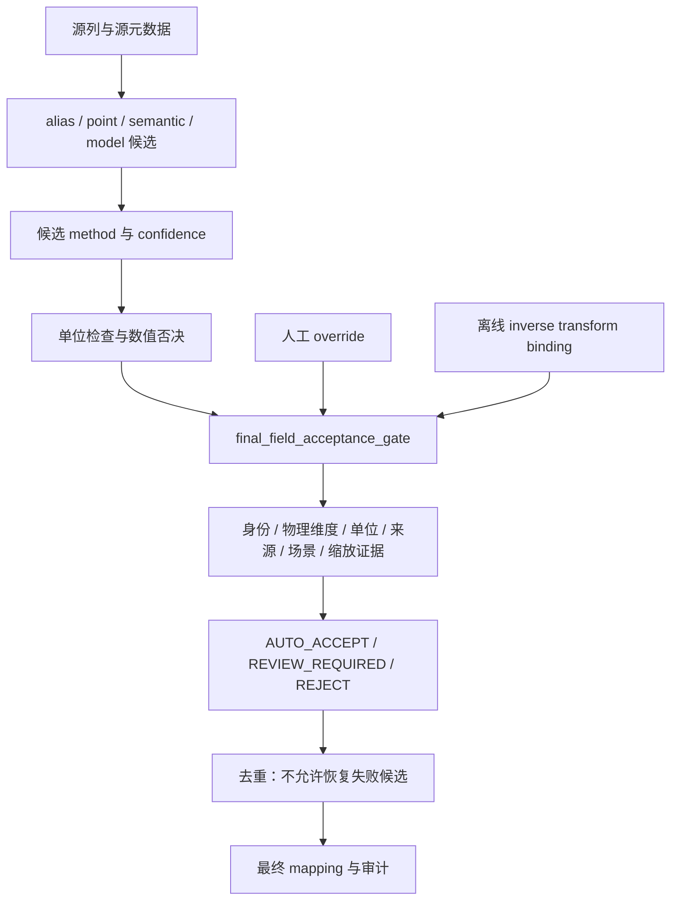

# 字段接受路径审计

修复前：_match_one 中仅配置 physical_semantics 的场景调用 evaluate；trusted alias 把标准物理属性复制为源属性并直接通过物理维度。map_columns 对无 physical_gate_pass 的行默认放行；manual override 写 matched，duplicate resolver 又允许 manual 忽略门禁。匿名 U/y 列因 alias 被当作物理量接受。

| path | method | 原 physical/location/direction | 原 unit | 原直接 matched 风险 | 修复后 |
| --- | --- | --- | --- | --- | --- |
| 显式别名 | alias | trusted 跳过冲突 | 冲突可阻断，缺失继承 | 有 | final gate，源冲突优先 |
| 格式归一别名 | normalized_alias | 同上 | 同上 | 有 | final gate，保留位置/通道 |
| 学习记忆别名 | learned_alias | 同上 | 同上 | 有 | final gate |
| 厂商核心规则 | vendor_core_alias | 有合同才检查 | 有 | 无合同可放行 | final gate，无无条件 fallback |
| 模糊语义 | semantic | 有合同才检查 | 有 | 无合同可放行 | final gate |
| 模型候选 | trained_model / trained_model_auto | 有合同才检查 | 有 | 无合同可放行 | final gate，confidence 不证明身份 |
| 点位词典 | point_dictionary | 信任词典复制 | 部分 | 有 | final gate + scene/field/source/unit 绑定 |
| 匿名/缩放列 | alias U1…U8/y | 无身份元数据检查 | 继承合同单位 | 有 | 必须 field/scenario/unit/scale 元数据 |
| 人工映射 | manual | 跳过 | 仅记录冲突 | 有 | 重新 final gate，无豁免 |
| 离线逆变换 | normalization_mapping | 未统一接入 | 检查参数 | 元数据绑定可能错测点 | dataset_evidence 中统一 gate |
| 去重 | duplicate resolution | manual 可绕过 | 不重验 | 有 | gate pass 优先；失败不能恢复 matched |

数字范围只用于否决/降低候选置信度；不构成字段身份。所有运行时返回 matched 的候选先过 final gate，人工更新中的临时状态不会绕过最终检查。
