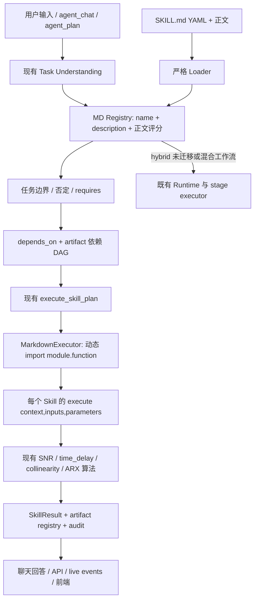

# Markdown Skill Runtime 架构

## 第一阶段边界

本次交付四个核心 Skill 的独立 MD 执行链。没有导入 SkillOS，没有删除原 catalog，没有重写工业算法。第二批十二项及完整闭环编排未在这一阶段迁移。

## Loader 与 Registry

- `core/skills/loader.py` 用 PyYAML SafeLoader 解析 front matter，拒绝重复 YAML key、缺字段、非法列表、非法参数声明、非法 executor 类型、缺模块/函数、错误函数签名和空正文。
- `core/skills/registry.py` 提供 register/get/list/search/resolve_dependencies/validate_dependency_graph/get_manifest/get_prompt_content。
- `core/apps.py` 在 Django 启动时构造 Registry 并验证依赖。非法文件直接报出路径及原因；不静默回退。尚未迁移的旧格式文档单列为 legacy_documents，不冒充新 manifest。
- 重复 ID、缺失依赖和环形依赖均拒绝注册。新增合法 manifest 不需修改 catalog；测试用新 ID 验证了真实执行。
- 默认 `SKILL_MANIFEST_MODE=hybrid`：MD 覆盖同 ID 的旧定义，其余从 catalog 补齐。`md`：只注册 MD；`legacy`：只使用旧定义。环境变量示例在 `.env.example`。
- 保持 `AGENT_RUNTIME_MODE` 现有职责。MD 执行验收使用默认 hybrid Agent Runtime；不要与禁用独立 Executor 的 `AGENT_RUNTIME_MODE=legacy` 混用。

## 选择与边界

现有 TaskSpec 继续承担任务理解；本次没有把规则模型宣称为 LLM。MD matcher 使用英文 token 与中文二元词，过滤通用词，评分为：

`0.35 × name/description 命中 + 0.55 × 正文命中 + 0.10 × trigger 召回`

阈值为 0.45。正文中的“不应该使用、失败、证据边界、下一步建议”不作为正向执行证据，但完整正文仍进入 Agent context，限制词命中也保留在 trace。测试验证仅正文中的专用表述可以召回，无需 trigger。

评分是文本相关度，不冒充 calibrated confidence。输入门禁是独立的硬条件：缺 artifact 或上游失败，执行必须 blocked/unavailable；不能靠高文字得分绕过。候选兼容前端的 candidate/final_score/preconditions/status 字段；不适用的场景评分保留 null。

解释、假设、引用和否定不执行算法。对“当前数据的信噪比是多少”这类实际测量请求，有 snapshot 时允许计算；无 snapshot 时保留分析计划，不伪造结果。

完整流水线和包含尚未迁移技能的混合请求保留原流程，输出 manifest_fallback。旧 resolver 的数据上下文默认候选不参与回退判定，避免单独 SNR 被额外的动态段能力劫持。

## 四个独立执行器

| Skill | 调用的唯一算法来源 | 输入 | 输出 |
|---|---|---|---|
| SNR | DataCleaningSelectionAgent.snr_details | CLEANED_TRAIN | SNR_ESTIMATES |
| 时滞 | TimeDelayCapabilityExecutor → estimate_training_delays / compensate_delays | MODELING_DATASET、FIELD_DICTIONARY | TIME_DELAY_ESTIMATES、DELAY_COMPENSATED_DATA |
| 共线性 | collinearity.correlation_matrix / compute_vif / recommend_variables | 补偿训练数据、时滞表 | COLLINEARITY_REPORT |
| ARX | validated_modeling.search_structure_orders | 训练、独立验证、时滞、共线性和 SNR 证据 | ARX_ORDER_SEARCH、ARX_SELECTED_STRUCTURE |

SNR 本身不要求先重新分段：直接读取已存在的 CLEANED_TRAIN。时滞同样使用已有建模训练数据。共线性依赖时滞；ARX 依赖 SNR 和共线性。这样纯 MD 模式不必假装旧治理节点也是 MD 算法。

ARX 原来的候选搜索循环只移动到共享函数，旧 run_validated_modeling 调用同一个函数。阶次 1–3、AR/ARX、正则化候选、稳定性/自由仿真门禁和验证 BIC 选择规则不变；不接触测试集。独立适配器使用上游已有时滞/共线性结果，避免重新估计。

## 输出、审计和兼容性

现有 SkillResult 外形、执行行、summary、API、事件通道保持。新增 manifest_source/manifest_path/manifest_hash/execution_mode/skill_doc；新增 Skill 详情 GET API。

每次 MD 执行 audit 记录 skill_id/version、manifest 路径/哈希、executor module/function、实际输入引用、参数快照、依赖运行、开始/结束时间、结果状态、metrics/artifacts/evidence/warnings。规划与执行时 hash 不一致会要求重新规划。未执行、阻断和纯文档读取分别记录，legacy 执行不会伪装成 MD executor 调用。

`md_response.py` 只从本次执行返回的 findings/metrics/limitations 组织回答，避免重复使用旧 pipeline 的 SNR/模型指标。前端只增加对 API display_name 的优先使用，没有重做页面。

## 闭环接口

`contracts.SkillRoundRecord` 定义 round_id、parameter_set、executed_skills、reused_skills、metrics、artifacts、validation_score、stop_reason。它是后续 Supervisor 的兼容收据结构；当前 optimizer 不会自动转为跨 Skill 的多轮 DAG。完整闭环迁移另见剩余项报告。
