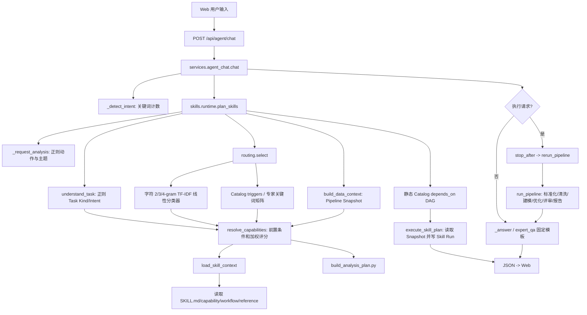

# A14 Agent + Skill Runtime Current State

## 审计结论

当前总控 Agent 是规则驱动编排器，不是 LLM Agent。工程未配置或调用 LLM Provider，也没有实际 system prompt。自然语言理解由三套规则和一个本地字符 n-gram 线性分类器共同完成；`SKILL.md` 会被读取并拼入返回 JSON，但没有消费者据此执行。真实算法执行仍由 `agent_chat.chat()` 把 Skill ID 映射为 `stop_after`，再调用 `rerun_pipeline()` / `run_pipeline()`。

## 当前调用链

## 各模块真实职责

- `agent_chat._detect_intent()`：按关键词命中数量选择聊天回答模板，并用人工公式产生置信度。
- `runtime._request_analysis()`：再次用正则判断 analyze/execute 和专家主题。
- `capability_resolver.understand_task()`：第三次用正则产生 task kind、semantic intents、输出、否定和显式 capability。
- `router_model.predict()`：字符 2/3/4-gram TF-IDF + 线性权重 + softmax，只适合作候选召回。
- `capability_resolver.resolve_capabilities()`：结合 DataContext 前置条件执行加权评分，是当前最接近单一 capability 真值的模块。
- `skill_loader.load_skill_context()`：发现 Skill，读取选中的文档并拼接字符串；该字符串没有进入 LLM 或 Executor。
- `build_analysis_plan()`：按 resolver trace 将 capability 分类为 selected/skipped/blocked，不执行分析。
- `execute_skill_plan()`：读取已有 Snapshot，生成 metrics/evidence 和审计 JSON，`summary.executed` 固定为 0。
- `rerun_pipeline()` / `run_pipeline()`：承担所有真实数据算法执行。

## 已确认问题

1. `_detect_intent`、`_request_analysis`、`understand_task` 和 Router 各自维护用户理解真值。
2. `loaded_skill_context` 只作为返回字段存在，没有运行消费者。
3. `SKILL.md` 的 input/output/evidence policy 不控制 Executor。
4. `execute_skill_plan()` 名称与行为不符，没有执行 Skill。
5. `skill_id -> stop_after -> rerun_pipeline()` 是实际执行路径。
6. `runtime._entities()` 仍硬编码三个场景，与 Registry 可用场景不一致。
7. discovery 为解析 manifest 会读取整个 `SKILL.md`，不是真正轻量发现。
8. 最终回答由固定 Python 模板生成，不能直接受 Skill 文档约束。

该报告是重构前基线。后续迁移必须保留 `legacy`，默认采用 `hybrid`，并让 `skill_runtime` 模式通过独立 Executor 完成 industrial-analysis。
