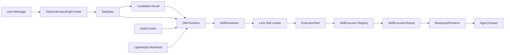

# Agent Skill Runtime Target Architecture

## 目标链路

## 单一真值

- `TaskSpec`：目标、任务类型、意图、输出、实体、参数、约束、执行模式、否定、多轮上下文与澄清状态。
- `SkillResolution`：选中/拒绝 Skill，selected/blocked/skipped Capability 及可解释评分。
- `analysis_plan`：Executor 唯一接受的 capability 执行清单。
- `SkillExecutionResult`：facts、findings、hypotheses、limitations、metrics、evidence、artifacts 与 trace。

## Provider 和运行模式

`TaskUnderstandingProvider` 与 `ResponseRenderer` 均提供 LLM 和 deterministic 两种实现。当前工程没有 LLM Provider，因此实际使用明确命名的 `LegacyRuleTaskUnderstandingProvider` 和 `DeterministicResponseRenderer`，没有把规则伪装成 LLM 语义理解。

`AGENT_RUNTIME_MODE` 支持：

- `legacy`：旧路由和 Snapshot evidence reader。
- `hybrid`（默认）：TaskSpec + 统一 Resolver + industrial-analysis Executor；无法解析标准化数据时允许旧证据读取，明确执行旧 Pipeline 的既有功能仍兼容。
- `skill_runtime`：industrial-analysis 只走 Skill Executor；Agent chat 不调用 `rerun_pipeline()`。

## Skill 协议

Discovery 优先读取 `manifest.json`，选中 Skill 后才读取 `SKILL.md` 正文、选中的 capability、所需 workflow/reference。详细 `SKILL.md` manifest 的 input/output/execution/evidence policy 在加载时合并为有效 Runtime 协议，并传给 Executor。

旧 Pipeline 保留为可兼容的 workflow。新 Executor 接口不接受 `stop_after`，而是接受 `skill_id + capability_ids + TaskSpec + DataContext + inputs + runtime_context`。
