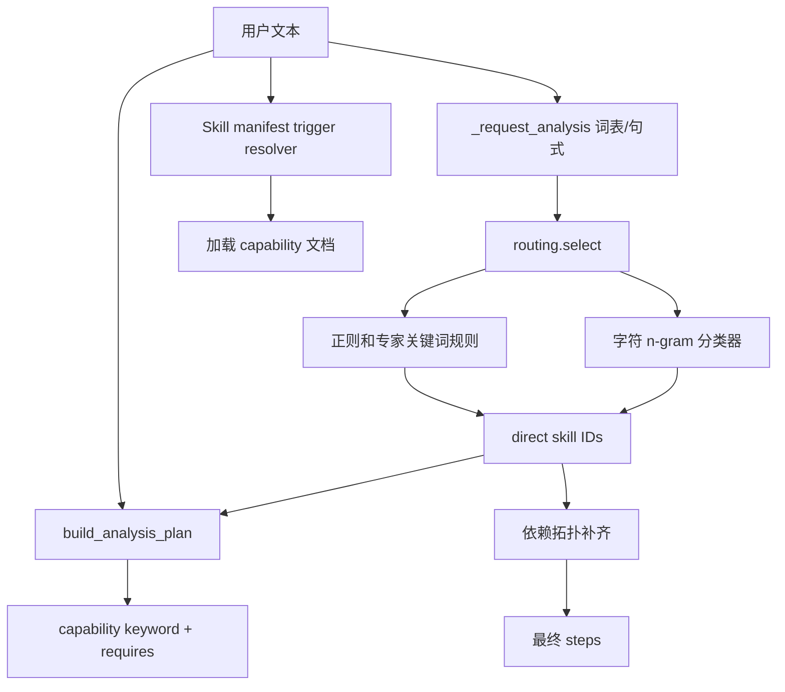
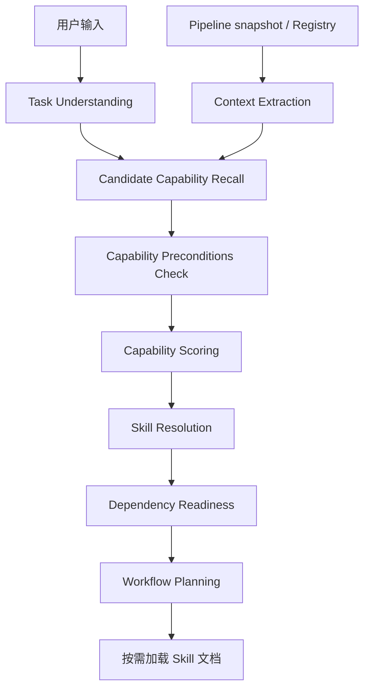

# Skill / Capability 选择机制审计报告

## 结论

当前实现不是纯粹的 `if keyword -> capability`，因为外层已有字符 n-gram 线性分类器、否定/疑问句保护和依赖拓扑排序；但整体仍然**主要由用户文本的词法信号驱动**，尚未形成“任务理解 → 数据上下文 → capability 前置条件 → 评分 → Skill 解析 → 工作流规划”的闭环。

更严重的问题是当前存在三条相互独立、结果可能冲突的选择路径：

1. `routing.py` 用字符 TF-IDF / 线性分类器选择工程级 skill ID，并叠加正则规则和专家关键词表。
2. `skill_loader.py` 用 `SKILL.md` manifest 的 substring triggers 选择 Skill 和 capability 文档。
3. `build_analysis_plan.py` 再用另一份 capability keyword 表决定分析 capability。

外层路由、加载器和 analysis plan 之间没有共享统一的 Task Intent、Data Context、Capability Candidate 或评分结果。`run_id` 虽传入 `plan_skills()`，但只写入输出中的 `task_context`，没有读取对应 Pipeline snapshot。

## 1. Skill Discovery

实现位置：`core/skills/skill_loader.py:45-68`。

Discovery 对每个 root 执行 `root.glob("*/SKILL.md")`，读取 YAML 风格 frontmatter 和 `skill-runtime-manifest` HTML comment，要求：

- frontmatter 存在 `name`
- manifest 是合法 JSON
- Skill 位于 root 的直接子目录

默认 root 只有 `core/skills`。Discovery 能发现独立 Skill、校验声明路径不越界、记录读取错误和耗时；它不使用任务上下文，也不解析 capability 前置条件。

## 2. Skill Resolver

实现位置：`core/skills/skill_loader.py:76-91`。

`resolve_skill()` 的实际算法为：

```text
normalized = message.lower()
hits = [trigger for trigger in manifest.triggers if trigger in normalized]
score = len(hits)
选择 hit 数最多的 Skill；最高分为 0 时不选择
```

因此 Skill 级 Discovery 与 Resolution 完全依赖 manifest trigger substring。没有 semantic intent、scene、数据字段、样本数、质量、设备、时间轴、依赖可用性或负向意图评分。

## 3. 外层 capability matcher 使用的字段

工程级 `SkillDefinition` 位于 `core/skills/catalog.py:68-115`，包含：

- `id`, `name`, `category`, `description`
- `triggers`
- `depends_on`
- `handler`, `version`
- `supported_scenarios`, `task_types`, `workflow_scope`, `scope`
- `references`, `related_references`, `overlaps_with`, `duplicate_of`
- `hardcoded_scene_or_field`, `engineering_only`

实际选择阶段主要使用 `id`、`triggers`、`depends_on`。`description`、`supported_scenarios`、`task_types`、`workflow_scope`、`references` 等字段基本未参与候选评分。

`routing.py` 的分类模型使用用户文本的 2/3/4 字符 n-gram；模型阈值为 probability 0.12、margin 0.03、lexical coverage 0.2。随后用正则处理否定、动作、问句、全流程命令和强制 grammar route。它仍只看 message。

## 4. Keyword / regex / trigger 的位置

- `core/skills/routing.py`
  - `NEGATIVE`, `ACTION`, `QUESTION`, `FULL_RUN` 正则
  - explicit action grammar
  - expert topic term list的二次命中
- `core/skills/runtime.py:24-50`
  - `EXPERT_ROUTING_RULES`，21 组固定术语
  - `_request_analysis()` 通过 substring 生成 topics
  - `_entities()` 与 `_parameters()` 使用正则
- `core/skills/catalog.py:198-232`
  - 30 个工程级 Skill 的 `triggers`
  - `identify_scene_from_text()` 使用场景 alias substring
- `core/skills/industrial-analysis/SKILL.md:8-23`
  - Skill 和 14 个 capability 的 manifest triggers
- `core/skills/skill_loader.py:76-91, 120-139`
  - Skill / capability / workflow 文档的 substring trigger
- `core/skills/industrial-analysis/scripts/build_analysis_plan.py:12-26, 86-103`
  - 14 个 capability 的另一份 keyword 表与命中逻辑

代码未逐字出现大量独立的 `if "异常" in query`，但其等价逻辑广泛存在于 `term in normalized`、`any(word in normalized ...)`、正则和 trigger 遍历中。

## 5. 当前选择流程



顺序上，工程级 Skill **先于** `analysis_plan` 选择：`plan_skills()` 在 `runtime.py:172-180` 先运行外层 route，`185-189` 再运行 Skill Loader，`191` 才生成 analysis plan。随后 `206-229` 才补治理 Skill 和依赖并形成 steps。

这与 Skill 文档宣称的“先规划后执行”不完全一致：执行前确实生成 plan，但 capability / Skill 的初选已经发生在 plan 之前。

## 6. 数据上下文使用情况

`build_analysis_plan.py` 本身具备一套有价值的前置条件框架：

- readable data
- numeric / multiple numeric fields
- ordered data
- sufficient samples
- confirmed energy / quality semantics
- equipment context
- process variables / relationships

但真实 Runtime 调用 `build_analysis_plan(text, direct, scene=...)` 时没有传 `evidence`。代码在 context 为空时还会执行 `missing = []`，等于主动跳过全部前置条件检查。

当前实际情况：

| 上下文 | 是否用于最终选择 |
|---|---|
| scene | 仅从用户文本 alias 猜测；不读取数据检测场景 |
| field semantics | 否 |
| data quality | 否 |
| available columns | 否 |
| time axis | 否 |
| sample count | 否 |
| equipment context | 仅从用户文本正则抽取，不读取 Registry / snapshot |
| mapping / scene confidence | 否 |
| dependency readiness | 只做静态 `depends_on` 拓扑，不检查数据或产物是否可用 |

`agent_chat.chat()` 在调用 `plan_skills(message, snapshot["run_id"])` 前已经拿到 snapshot，但 planner 不接收 snapshot；执行阶段才用 snapshot 做场景不一致和 stop-after 判断。这太晚，不能影响 capability 候选与打分。

## 7. 存在的问题

1. **三套真值**：model route、manifest triggers、analysis-plan keywords 可输出不同选择。
2. **run_id 是装饰字段**：没有解析对应运行的数据上下文。
3. **前置条件旁路**：无 evidence 时清空 missing requirements，使 requires 只在 standalone 显式调用时生效。
4. **词法泛化弱**：未出现训练 n-gram 或明确 trigger 的同义表达容易进入 clarification。
5. **知识解释与分析执行边界不统一**：“解释一下异常检测是什么”外层没有选执行 Skill，但 Loader 仍加载 `ANOMALY_DETECTION`，analysis plan 仍选择异常能力。
6. **缺少统一候选 trace**：现有 trace 只有模型 score、margin、coverage 或 matched triggers，没有 context/precondition/scene/dependency 分项。
7. **静态依赖不等于 readiness**：依赖顺序正确，但没有判断所需标准化数据、数值列、时间戳或阶段产物是否存在。
8. **场景列表陈旧**：`SUPPORTED_SCENARIOS` 仍固定三个场景，和当前 Registry 六个场景不一致。
9. **默认 capability 过宽**：DATA_PROFILING、DATA_QUALITY_ANALYSIS、MISSING_DATA_ANALYSIS 在 analysis plan 中总是 requested，未依据任务类型与数据状态区分。
10. **语义 score 名不副实**：router softmax 是未校准的闭集分类概率，不能直接当作跨候选置信度。

## 8. 建议的新流程



### Task Understanding

统一产出：

- `task_kind`: `data_analysis | knowledge_explanation | execute_pipeline | artifact_request`
- `semantic_intents`: 如 `locate_abnormal_behavior`, `compare_with_normal_operation`, `prioritize_time_windows`
- `requested_outputs`: findings、time ranges、plots、explanation
- `execution_requested`: bool
- `negations`, `constraints`, `explicit_capabilities`

“解释一下异常检测是什么”应得到 `task_kind=knowledge_explanation`，不会进入数据 capability 执行候选。

### Context Extraction

由 host 在调用 planner 前从 snapshot 和 Registry 生成只读 `DataContext`：

- detected scene、scene confidence、scene status
- standardized fields、roles、semantic types、mapping confidence
- numeric field count、sample count、timestamp、ordered / regular time axis
- missing/anomaly rate、data quality、available pipeline artifacts
- equipment/process context

项目 UI scene 只能作为 `project_context_scene`，不能替代 detected data scene。

### Candidate Recall

保留三类召回信号，并只负责扩大候选集：

- 关键词 / manifest triggers
- n-gram 或 embedding semantic retrieval
- context-derived defaults，例如有时序数值数据且任务是开放式诊断时召回 profiling、quality、trend、anomaly

召回不能直接标记 selected。

### Preconditions Check

每个 capability 使用结构化声明：

```json
{
  "requires": {
    "all": ["readable_data", "numeric_fields", "sufficient_samples"],
    "any": ["ordered_data", "timestamp"]
  },
  "produces": ["anomaly_windows", "anomaly_scores"],
  "depends_on": ["DATA_PROFILING", "DATA_QUALITY_ANALYSIS"]
}
```

前置条件不足时记录 `blocked` / `deferred`，不得靠关键词强行选择。

## 9. Capability scoring 设计

建议对通过硬前置条件的候选计算：

```text
final_score =
    0.35 * semantic_intent_score
  + 0.20 * context_fit_score
  + 0.20 * data_precondition_score
  + 0.10 * scene_fit_score
  + 0.10 * dependency_readiness_score
  + 0.05 * lexical_recall_score
```

- `semantic_intent_score`：任务语义与 capability 描述/intent examples 的相似度。
- `context_fit_score`：当前字段类型、角色、质量状态和期望输出是否适配。
- `data_precondition_score`：requires 的满足比例；硬条件失败直接 blocked。
- `scene_fit_score`：通用 capability 对已确认场景通常为中高分，领域 capability 需匹配 scene/equipment/process。
- `dependency_readiness_score`：依赖 capability 或已有 artifact 是否可用。
- `lexical_recall_score`：关键词只占 5%，用于可解释召回，不决定最终选择。

`confidence` 应由 top score、top-2 margin、上下文完整度和语义模型校准状态共同生成，不直接复用未校准 softmax。

建议 trace：

```json
{
  "candidate": "ANOMALY_DETECTION",
  "semantic_intent_score": 0.82,
  "context_fit_score": 0.91,
  "data_precondition_score": 1.0,
  "scene_fit_score": 0.80,
  "dependency_readiness_score": 1.0,
  "lexical_recall_score": 0.20,
  "final_score": 0.87,
  "preconditions": {
    "numeric_fields": true,
    "sufficient_samples": true,
    "ordered_data": true
  },
  "selected": true,
  "reason": "任务要求定位偏离正常运行的区间，且当前时序数值数据满足异常检测条件"
}
```

## 10. 当前五个同义任务测试

测试直接调用当前 `plan_skills()`，未修改代码。

| 表达 | 外层 direct skills | analysis capabilities | capability loader | 结论 |
|---|---|---|---|---|
| 帮我找异常 | 无；needs clarification | profiling、quality、anomaly、missing | anomaly | 外层漏选 |
| 这批数据有没有不正常的地方 | engineering_result_interpreter | profiling、quality、missing | 无 | 漏掉 anomaly / trend |
| 看看哪里和正常运行不一样 | 无；needs clarification | profiling、quality、missing | 无 | 漏掉 anomaly / trend |
| 哪些时间段值得重点检查 | 无；needs clarification | profiling、quality、missing | 无 | 漏掉 trend / anomaly |
| 这批数据波动是不是有问题 | engineering_result_interpreter | profiling、quality、anomaly、missing | 无 | 部分命中，三层结果不一致 |

五条表达没有得到基本一致的核心规划，证明当前同义泛化和跨层一致性不合格。目标方案应让五条在具备有效时序数据上下文时共同选择：

- `DATA_PROFILING`
- `DATA_QUALITY_ANALYSIS`
- `TREND_ANALYSIS`
- `ANOMALY_DETECTION`

可根据“时间段”“正常运行”等语义追加 `TIME_SERIES_ANALYSIS` 或 `PROCESS_STABILITY`，但核心四项应稳定。

## 11. 反例测试

输入：“解释一下异常检测是什么”。

当前结果：

- mode：analyze
- 外层 direct skills：空
- 不会触发 Pipeline 执行
- Skill Loader：仍加载 `ANOMALY_DETECTION`
- analysis plan：仍选择 profiling、quality、anomaly、missing
- needs clarification：true

执行安全边界暂时守住了，但任务理解不正确。它应被识别为 `knowledge_explanation`，只加载概念说明或回答知识问题，不生成数据分析 capability plan，也不要求上传/执行数据。

## 12. 建议修改文件（本次未修改）

建议后续实现阶段修改：

- `core/skills/runtime.py`：读取 snapshot，编排统一 Task Understanding / Context / Scoring / Planning。
- `core/skills/routing.py`：降级为候选召回与动作/否定边界，不直接成为最终选择器。
- `core/skills/skill_loader.py`：接受已解析的 selected Skill / capabilities，不再重复用 trigger 做最终决策。
- `core/skills/catalog.py`：增加结构化 capability、preconditions、produces、intent examples 和场景适配声明。
- `core/skills/industrial-analysis/scripts/build_analysis_plan.py`：接收完整 DataContext，统一评分与 explainable trace；取消无 context 时清空 requirements 的旁路。
- `core/agent_api.py`、`core/services/agent_chat.py`：在规划前读取并传入运行快照上下文。
- `core/test_skill_routing.py`：增加五组同义一致性、知识解释反例、缺少前置条件、scene/field/time-axis context 测试。
- `core/test_skill_loader.py`：验证 loader 严格按 resolver 结果加载，不自行二次决策。
- 新增建议：`core/skills/context.py`、`core/skills/capability_resolver.py`，分别承担上下文提取和统一评分，避免继续扩大 `runtime.py`。

本次审计只新增本报告，没有修改 Skill、capability、Resolver 或 Runtime 实现。
