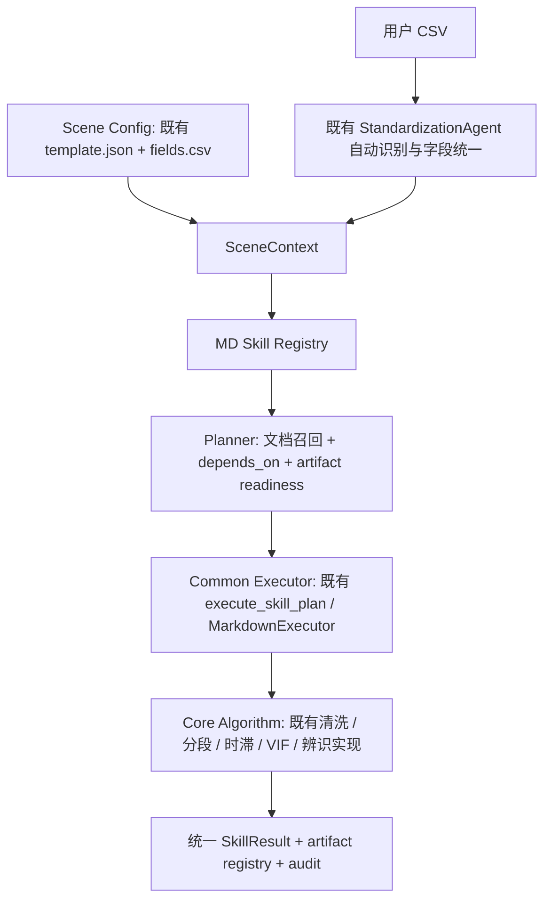
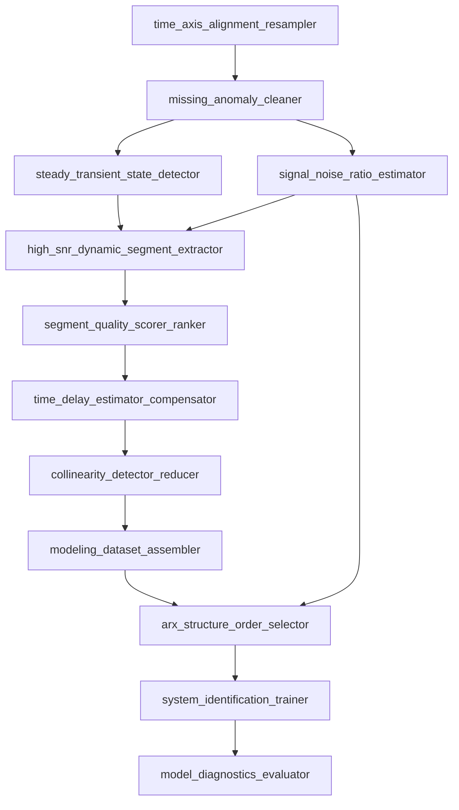

# 三场景通用 Skill 架构

沿用第一阶段 MD Registry、Loader、Planner 和 execute_skill_plan，没有第二套 Runtime。本阶段由 4 个扩展到 12 个 Markdown Skill；场景只提供字段角色、单位、约束和默认参数。

## 配置与 Context

扩展 `integrations/standardization/standards/scenarios/{blast_furnace,debutanizer_column,industrial_dryer}/template.json`，保留 `fields.csv` 为字段、别名、单位的唯一明细。template 的 units/aliases 是对该文件列的声明，不复制第二份映射表。

`core/skills/context.py::build_scene_context` 输出 scenario_id、scenario_name、dataset_ref、timestamp_column、input_columns、target_column、units、sampling_interval、constraints、default_parameters、metadata。数据场景遵循 final_scene → selected_scene → agent_scene → detected_scene → standardization.scenario；project_scene 仅进入 metadata.project_context_scene。

默认参数依次合并：SKILL.md → SceneContext.default_parameters → skill_overrides → 显式参数。实际值及 SceneContext 进入每个执行/阻断节点的 audit。高炉/塔/干燥器 max_lag 分别保持 24/75/60，采样周期 3600/60/10 秒；不为提高通过率降低门限。

## 共用 DAG

requires 补充跨节点产物边；已有输入产物完整满足 requirements 时，Planner 可省略上游重新计算。完整图校验仍检查全部 depends_on，不能利用剪枝绕过依赖环检查。

## 唯一算法实现与迁移职责

| Skill | 共用实现 | 模式 |
|---|---|---|
| time_axis_alignment_resampler | DataCleaningSelectionAgent.align_timestamp | execute |
| missing_anomaly_cleaner | 同一 Agent.process_missing_values / detect_and_repair_anomalies | execute |
| signal_noise_ratio_estimator | 同一 Agent.snr_details | execute |
| steady_transient_state_detector | segmentation_service.run_segmentation_stage / select_dynamic_segments | execute |
| high_snr_dynamic_segment_extractor | segmentation_service.select_modeling_rows / select_modeling_windows | execute |
| segment_quality_scorer_ranker | 读取上一步已排序分数，不重复窗口计算 | read |
| time_delay_estimator_compensator | TimeDelayCapabilityExecutor → estimate_training_delays / compensate_delays | execute |
| collinearity_detector_reducer | 既有共线性诊断及变量推荐 | execute |
| modeling_dataset_assembler | 组装已选训练行与推荐字段 | read |
| arx_structure_order_selector | validated_modeling.search_structure_orders | execute |
| system_identification_trainer | 复用上述真实拟合系数，validated_modeling.evaluation 评价一次独立测试集 | execute |
| model_diagnostics_evaluator | 既有 ModelDiagnosticsCapabilityExecutor | execute |

八个新 executor.py 只调用 `core/skills/stage_adapters.py` 中的适配函数。选窗规则抽成既有 segmentation_service 内的 select_modeling_windows，旧 select_modeling_rows 和新产物写入共用该规则，避免选段记录与实际训练行不一致。

没有发现三份重复的 blast_furnace_pipeline / debutanizer_pipeline / dryer_pipeline，因此没有虚构“删除三套算法”的迁移记录。新增 `core/services/scene_skill_pipeline.py::run_scene_skill_pipeline` 是场景无关的原始文件入口：自动标准化 → 注册产物 → build_scene_context → plan_skills → execute_skill_plan。原 pipeline/API wrapper 保留，未改成此入口的仍是旧通用阶段编排，不是场景专用数值实现。

## 科学边界与兼容

- 原始数据先冻结 60/20/20 时间分区，再各自对齐清洗；不插值制造 target，不向过去填未来化验值，不上采样伪造样本。
- 时滞使用冻结分区的实际采样周期。结构选择不读取测试集；系统辨识复用 fitted_state，并检查测试时间严格晚于验证终点。
- 原有优质动态段 score >= 80、SNR >= 10 保留。无严格窗口时，原有候选策略仍可供探索，但结果明确 partial。
- 统一结果包含 status、metrics、artifacts、evidence、warnings、suggested_next_skills。SNR 增加 per_variable_snr / summary_snr，保留旧字段以兼容客户端；不可估计为 null。
- 知识说明不构造执行 DAG；现有专家证据问答在没有本轮数值执行时仍保留，不由无关 MD 摘要覆盖。
- Registry/Planner 的改动限于依赖输入复用、边界保护与可选 intent_terms 召回约束；仍是本地文档/词项匹配，不宣称向量检索或 LLM 语义规划已实现。
- API 路径及前端布局未更改。纯 MD 模式支持本次 12 个节点；其他未迁移业务继续由 hybrid/legacy 兼容。

## 通用性结论

12 个 Skill 的三场景计划具有相同 ID、manifest_path、executor_module；源代码无三场景名称分支。高炉和干燥器已实际数值调用，脱丁烷仅验证到标准化门禁及相同 DAG/audit。不能把后者算作完成了同一算法的三场景数值验收。
